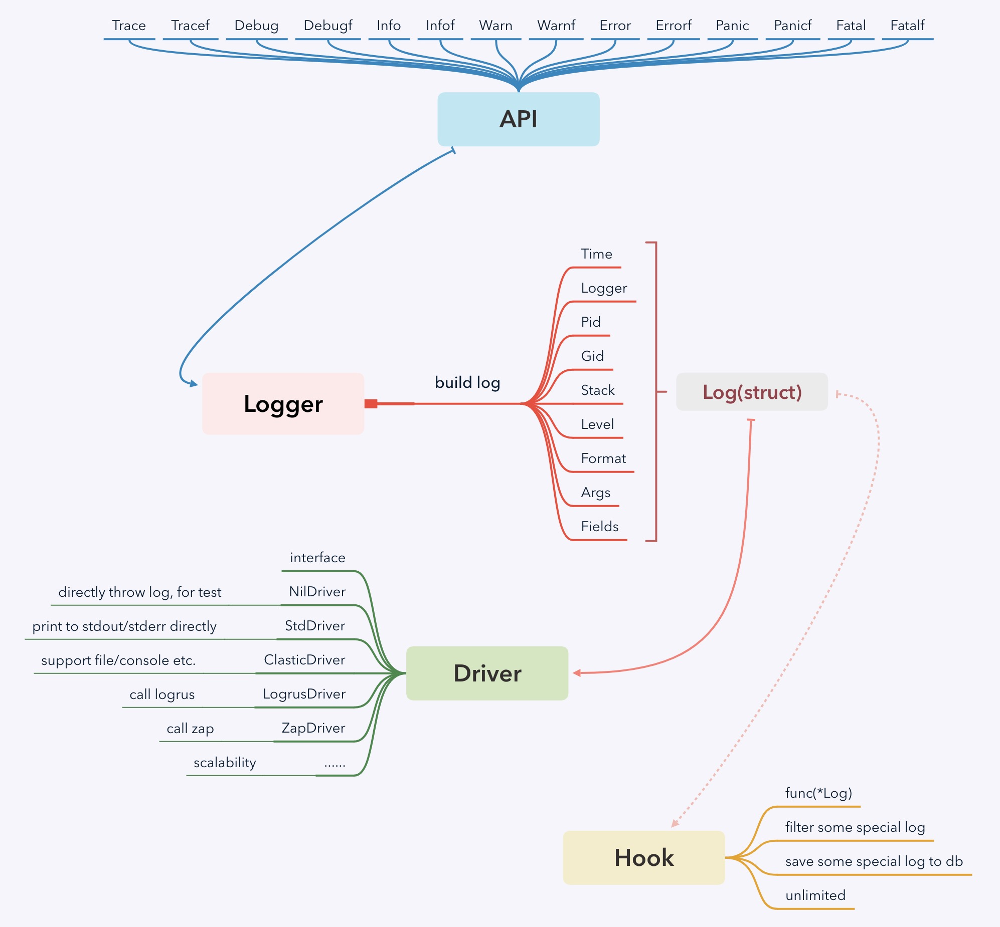

# Slf4go [](https://travis-ci.org/go-eden/slf4go)

Simple Logger Facade for Golang, inspired by `Slf4j`, it forced on performance and scalability.

# Introduction

`Slf4go` is different with other librarys like `logrus`/`zap`, it is more like a log specification. 

`Slf4go` have several components:

+ `log`: Log record's structure, contains `Time`, `Logger`, `Pid`, `Gid`, `Stack`, `Fields`, etc.
+ `logger`: Provide api for `Trace`, `Debug`, `Info`, `Warn`, `Error`, `Panic`, `Fatal`.
+ `driver`: It's an interface, used for decoupling `Api` and `Implementation`.
+ `hook`: Provide a hook feature, can be used for log's async hook.

For better understanding, check this chart.



`Slf4go` doesn't conflict with other library, thanks to `Driver` interface, `Slf4go` can working on top of `logrus`/`zap`etc. 

# Features

TODO

# Install

```bash
go get github.com/go-eden/slf4go
```

# Usage

## Use default logger

`Slf4go` wrapped a global default logger.

In most case, you can use it directly, don't need any prepare.

```go
Trace("are you prety?", true)
``` 

## Custom Driver

If you use native log or logrus, the code below shows you how it works.

If you use other logger frameworks, you need implement `LoggerFactory` by yourself.

## Use native log as logger

```go
package main

import (
    "github.com/sisyphsu/slf4go"
    "github.com/sisyphsu/slf4go/example/modules"
)

// doesn't need initialize

// use slf4j everywhere
func main() {
    logger := slf4go.GetLogger("main")
    logger.DebugF("I want %s", "Cycle Import")
    logger.ErrorF("please support it, in %02d second!", 1)
    modules.Login()
}

// just use slf4go everywhere, doesn't care aboud the implement.
func Login() {
    logger := slf4go.GetLogger("login")
    logger.Info("do login")
    logger.ErrorF("login result %s", "failed")
}
```

## Use logrus as logger


```go
package main

import (
    log "github.com/sirupsen/logrus"
    "os"
    "github.com/sisyphsu/slf4go"
    "github.com/sisyphsu/slf4go/adapter/logrus"
)

// initialize logger, just like `log4j.properties` or `logback.xml`
func init() {
    // Log as JSON instead of the default ASCII formatter.
    log.SetFormatter(&log.JSONFormatter{})
    // Output to stdout instead of the default stderr, could also be a file.
    log.SetOutput(os.Stdout)
    // Only log the warning severity or above.
    log.SetLevel(log.WarnLevel)
    logger := log.New()
    // customize your root logger
    slf4go.SetLoggerFactory(logrus.NewLoggerFactory(logger))
}

// use slf4go everywhere
func main() {
    logger := slf4go.GetLogger("main")
    logger.DebugF("I want %s", "Cycle Import")
    logger.ErrorF("please support it, in %02d second!", 1)
}
```

# Benefit

As we can see, golang changes very quickly, and the logger-tech isn't very mature.

Separate the logger implement from modules maybe a good idea.

if oneday you need to use `logxxx` replace `logrus`, 
do you want to change all code contains `log.info(...)`?
   
or only change `logger_init.go`?